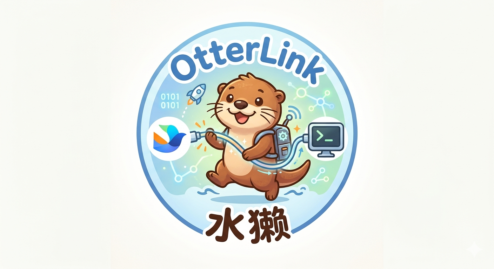

# OtterLink

<p align="center">
  
</p>

<p align="center">
  <strong>水獭 / OtterLink</strong><br />
  A local relay for Feishu and coding agents.
</p>

OtterLink connects Feishu conversations to local agent runtimes such as `codex` and `claude_code`. It keeps session state on your machine, routes runtime control commands from chat, streams progress back to Feishu, and provides a local operator CLI for install, configuration, and service management.

## Why OtterLink

- Use Feishu as the control surface for local coding agents.
- Keep runtime execution and session state on your own machine.
- Switch agent, workspace, proxy, and session directly from chat.
- Support both operator workflows and service deployment.
- Keep the gateway thin: authenticate Feishu, route sessions, and forward all authenticated text to Rust core.
- Separate integration concerns cleanly:
  - Rust owns slash-command handling, sessions, turns, persistence, and runtime orchestration.
  - Node.js owns Feishu delivery, auth, pairing, deduplication, and rendering.

## Features

- Feishu bot ingress with pairing or allow-list auth modes
- Rust core for session state, turn orchestration, and runtime isolation
- ACP and `exec_json` runtime support
- In-chat control commands via `/ot ...`
- Local CLI via `otterlink ...`
- Linux `systemd` and macOS `launchd` deployment
- Shared card/text rendering with graceful fallback on Feishu update failures
- Runtime-level proxy control with per-agent defaults
- Inbound Feishu `message_id` deduplication to avoid duplicate turn submission

## Architecture

OtterLink is split across two runtime boundaries:

1. `gateway/`
   Handles Feishu WebSocket or webhook ingress, auth, pairing, routing, and message/card delivery.
2. `src/`
   Handles local runtime execution, turn state, persistence, prompt/session lifecycle, and normalized outbound events.

Key directories:

- `src/agent/`: ACP adapters, exec runtimes, normalized stream handling
- `src/core/`: sessions, turns, persistence, control flow, prompt assembly
- `src/api/`: internal ingress from gateway to core
- `gateway/`: Feishu gateway service and rendering logic
- `scripts/`: install, configure, start, stop, reload, smoke helpers
- `deploy/systemd/`: Linux service templates
- `deploy/launchd/`: macOS service templates
- `docs/`: architecture, configuration, interfaces, operations, installation

## Quick Start

Clone the repository and run the installer:

```bash
git clone <your-repo-url>
cd otterlink
./scripts/install-one-click.sh
```

Then configure and start:

```bash
otterlink configure
otterlink start
otterlink status
```

The installer will:

- install Rust automatically if missing, using the project default toolchain `1.94.0`
- install Node.js automatically if missing, using the project default version `22.22.1`
- build the Rust binary
- install gateway dependencies
- install the `otterlink` CLI into `~/.local/bin`
- detect and optionally install supported ACP runtimes

## Operator CLI

Common commands:

```bash
otterlink configure
otterlink install-acp all --if-missing
otterlink doctor
otterlink start
otterlink stop
otterlink restart
otterlink status
```

`otterlink configure` writes the local runtime env file and lets you configure:

- Feishu `APP_ID` and `APP_SECRET`
- long-connection mode
- default agent and default workspace
- default proxy URL
- per-agent proxy defaults for `claude_code` and `codex`

## Feishu Control Commands

Once the bot is online, you can control the runtime from Feishu:

```text
/ot help
/ot show
/ot list
/ot load
/ot load /absolute/path
/ot use codex
/ot pick c06c9a5e
/ot new my-task
/ot cwd ~/workspace/project
/ot proxy default
/ot proxy on http://127.0.0.1:7890
/ot proxy off
/ot stop
```

Chinese aliases are also supported:

```text
会话 帮助
会话 查看
会话 列表
会话 加载
会话 切换 codex
会话 选择 c06c9a5e
会话 新建 my-task
会话 工作区 ~/workspace/project
会话 停止
```

## Runtime Model

OtterLink distinguishes three concepts:

- `worker`: the long-lived runtime process and ACP connection
- `session`: the agent-side conversation session
- `turn`: a single user request within a session

The gateway sends trusted turn requests into the Rust core. The Rust core emits normalized progress, todo, and final events back to the gateway, which renders them into Feishu text or CardKit cards.

## Local Development

Build and test:

```bash
cargo test
cd gateway && npm test
```

Run the services manually:

```bash
cargo run --bin otterlink
cd gateway && npm start
```

Or use the local wrapper:

```bash
./scripts/start-longconn.sh
./scripts/stop-longconn.sh
```

## Deployment

Linux with `systemd`:

```bash
sudo SERVICE_USER="$USER" \
  SERVICE_GROUP="$(id -gn)" \
  ENV_FILE=/etc/otterlink/otterlink.env \
  ./scripts/install-systemd.sh
```

Reload after env or binary updates:

```bash
sudo ./scripts/reload-systemd.sh
```

macOS with `launchd`:

```bash
./scripts/install-launchd.sh
./scripts/reload-launchd.sh
```

## Configuration

Important environment variables:

- `APP_ID`, `APP_SECRET`: Feishu bot credentials
- `BIND`: gateway bind address
- `CORE_BIND`: Rust core bind address
- `CORE_INGEST_TOKEN`: protects `gateway -> core`
- `GATEWAY_EVENT_TOKEN`: protects `core -> gateway`
- `FEISHU_AUTH_MODE`: `off | pair | allow_from | pair_or_allow_from`
- `ALLOW_FROM_OPEN_IDS`, `PAIR_AUTH_TOKEN`, `PAIR_STORE_PATH`
- `RUNTIME_MODE`: `acp | exec_json | acp_fallback`
- `ACP_ADAPTER`: default agent kind
- `ACP_PROXY_URL`: default proxy URL
- `CLAUDE_CODE_DEFAULT_PROXY_MODE`
- `CODEX_DEFAULT_PROXY_MODE`
- `CLAUDE_HOME_DIR`, `CODEX_HOME_DIR`

For full configuration details, see [docs/configuration.md](docs/configuration.md).

## Documentation

- [docs/README.md](docs/README.md): documentation index
- [docs/architecture.md](docs/architecture.md): system boundaries and flow
- [docs/design.md](docs/design.md): design decisions and runtime model
- [docs/interfaces.md](docs/interfaces.md): internal interfaces and payloads
- [docs/configuration.md](docs/configuration.md): env vars and operator settings
- [docs/data-model.md](docs/data-model.md): persistence model
- [docs/operations.md](docs/operations.md): day-2 operations
- [docs/acp.md](docs/acp.md): ACP runtime behavior and protocol mapping
- [docs/installation.md](docs/installation.md): Linux installation
- [docs/macos-installation.md](docs/macos-installation.md): macOS installation

## Repository Layout

```text
.
|-- src/
|   |-- agent/
|   |-- api/
|   `-- core/
|-- gateway/
|-- scripts/
|-- deploy/
|   |-- launchd/
|   `-- systemd/
`-- docs/
```

## Security Notes

- Do not commit `.run/`, bot credentials, or real Feishu identifiers.
- Keep `CORE_BIND` private; the Rust core trusts the gateway.
- Always set `CORE_INGEST_TOKEN` and `GATEWAY_EVENT_TOKEN` in non-local deployments.
