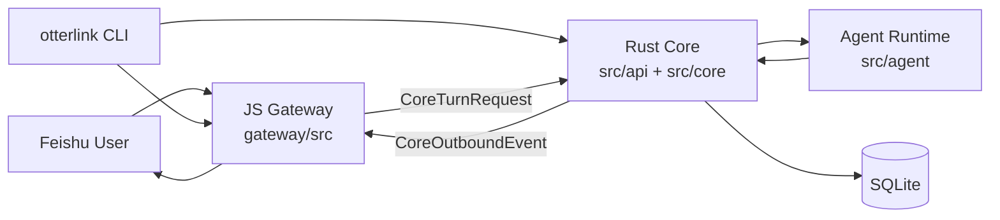

# 架构总览

## 目标

项目负责把飞书消息接入本机 agent runtime，并把运行过程和最终结果优雅地回写到飞书。平台接入在 JS，agent/session 编排在 Rust。

## 分层

### 0. 本地控制台层

位置：`scripts/otterlink-cli.js` 与安装包装脚本。

职责：
1. 生成和维护 `.run/feishu.env`。
2. 检测并安装 `claude_code` / `codex` ACP runtime。
3. 统一执行 `start/stop/status/doctor`。
4. 作为源码部署后的本地运维入口。

### 1. gateway 层

位置：`gateway/`

职责：
1. 连接飞书官方 SDK / WebSocket。
2. 处理配对、白名单、用户身份认证。
3. 根据飞书上下文生成 `session_key`。
4. 将平台事件转换为 `CoreTurnRequest` 发给 Rust。
5. 解析 `/runtime ...` 控制命令并转换为 `CoreControlRequest`。
6. 将 Rust 返回的标准消息渲染为飞书 `text/post/interactive`。

### 2. core 层

位置：`src/core/` 和 `src/api/`

职责：
1. 管理 session、turn、prompt 组装和 sqlite 状态。
2. 调用 agent runtime。
3. 将 runtime 事件聚合成标准 `OutboundMessage`。
4. 通过 HTTP 回调把标准事件发回 gateway。

### 3. agent 层

位置：`src/agent/`

职责：
1. 封装 ACP 和 `codex exec --json`。
2. 标准化不同 agent 的事件流。
3. 对 core 暴露统一 `AgentRuntime` trait。

## 组件图

## 主数据流

1. 飞书消息进入 JS gateway。
2. gateway 完成 auth / pairing / session routing。
3. 普通消息走 `POST /internal/core/turn`；控制命令走 `POST /internal/core/control`。
4. Rust core resolve session、runtime binding、持久化状态。
5. 如果是 `load_runtimes`，core 会优先按当前 agent 调用 ACP `session/list`；agent 不支持时才回退本地目录或 sqlite 导入历史 session。
6. `/runtime stop` 这类控制命令会由 core 直接取消当前 turn，不经过普通 prompt 执行。
7. 普通 turn 启动 runtime，并持续输出统一事件。
8. core 生成 `progress` / `todo` / `final` 标准消息。
9. core 回调 gateway 的 `/internal/gateway/event`。
10. gateway 利用飞书卡片和 reply/update 能力完成展示。
11. 本地运维通过 `otterlink` CLI 修改 env、检测 ACP、并调用启动脚本管理 core/gateway。

## 边界原则

1. Rust 不理解 `open_id`、`tenant_key`、`chat_type`。
2. gateway 不管理 agent runtime 或 sqlite schema。
3. `session_key` 由 gateway 生成，Rust 只把它当 opaque string。
4. core 只信任本地 gateway，因此 `CORE_BIND` 不应暴露到公网。
