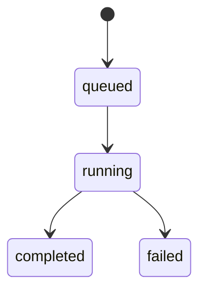

# 设计说明

## 核心决策

1. 平台接入统一放到 JS gateway。
   原因：飞书等 IM 平台的 SDK 现实上更偏 Node.js，后续接新平台成本更低。
2. Rust 只处理可信 turn 请求。
   gateway 已经完成认证和配对，Rust 不再做用户级鉴权。
3. `session_key` 由 gateway 计算。
   这样不同平台可以按自己的线程/群聊模型决定会话边界。
4. `OutboundMessage` 保持最小标准化。
   Rust 不直接输出飞书卡片 JSON，只输出通用文本、post、card、raw 四类消息。
5. 本地配置入口统一收敛到 `otterlink` CLI。
   原因：飞书凭据、代理、默认 agent、ACP 安装与启动脚本原先分散在多个文件里，用户很难以“控制台工具”的方式部署和维护。
6. 当前产品命名方向定为 `水獭 / OtterLink`，CLI 主命令定为 `otterlink`。
   原因：名字更贴近“常驻、本地、中继、轻巧协作”的产品气质，也适合作为后续 CLI 和品牌文案的统一基线。

## Session 设计

- 私聊：`feishu:p2p:<open_id>`
- 群聊：`feishu:chat:<chat_id>`
- 话题：`feishu:thread:<chat_id>:<thread_id>`

聊天会话和 agent 运行会话分离，当前选择器是三元组：

1. `agent_kind`
2. `workspace_path`
3. `runtime_session`

其中飞书会话当前只保存“选择器状态”，不强绑定某一个 agent 历史。

运行实体分层：

1. `session_key`
   稳定表示聊天上下文
2. `runtime_instance`
   表示某一个具体的 Claude/Codex 会话和 workspace
3. `runtime_selection`
   表示当前聊天里选中了哪个 `agent + cwd + session`

若是话题消息，gateway 同时传递父会话 `feishu:chat:<chat_id>`。当子会话尚未建立 runtime session 时，Rust 会把父会话最近一次 assistant 输出拼进 prompt。

## Runtime 控制

支持的 control action：

1. `show_runtime`
2. `list_runtimes`
3. `load_runtimes`
4. `use_agent`
4. `create_runtime`
5. `switch_runtime`
6. `set_workspace`

设计规则：

1. 普通消息只有在显式选定 session 后才会进入 runtime。
2. `/ot use <claude|codex>` 只切换 agent，并自动加载当前 `cwd` 下的候选 session。
3. `/ot pick <short_id>` 才会显式选定 session。
4. `/ot new` 会在当前 `agent + cwd` 下新建 session，并立即选定。
5. `/ot load [workspace]` 负责刷新当前 `agent + cwd` 下的候选 session，不隐式切换。
6. `set_workspace` 会清空当前 session 选择，并要求用户重新 pick 或 new。
7. `set_proxy` 会更新当前选择器的代理模式，影响后续 runtime 进程启动。
8. `stop_runtime` 只取消当前进行中的 turn，不改变当前三元组选择器。
9. `/ot pick` 选中已有 session 后，会把 ACP `session/load` 的历史回放缓存成一份独立的 `历史概览`，单独发卡片给用户确认当前进度。
4. 控制命令优先于普通 turn，但命令解析发生在 Rust `core`，不再发生在 gateway。
5. `/ot pick` 支持完整 `runtime_id`、`runtime_session_ref` 前缀、或 label，避免在 IM 里复制长 id。

会话导入规则：

1. 默认读取当前 active runtime 的 workspace。
2. 可显式指定其他 workspace。
3. 优先调用 runtime 自带的会话列举能力按当前 `agent + cwd` 列出候选会话。
4. 当前 `claude_code` 走 ACP `session/list`；`codex` 优先走 app-server `thread/list`，不可用时再回退读取 `CODEX_HOME_DIR/state_5.sqlite`。
5. 对 ACP runtime，真正恢复历史必须调用 `session/load`；如果 agent 不支持 `loadSession`，直接报错，不回退到 `session/new`。
6. 为兼容 macOS，`/tmp` 和 `/private/tmp` 两种目录键都会尝试。

代理策略：

1. 代理配置保存在当前 `runtime_selection` 中。
2. `default` 下按环境配置生效：`CODEX_DEFAULT_PROXY_MODE` 与 `CLAUDE_CODE_DEFAULT_PROXY_MODE`。
3. `on` 时会注入 `HTTP_PROXY / HTTPS_PROXY / ALL_PROXY`。
4. 代理地址优先取命令里显式传入，其次取 `ACP_PROXY_URL`，再回退现有代理环境变量。
5. `/ot stop` 对 ACP runtime 会先发送协议 `session/cancel`，等待 prompt 以 `cancelled` 收尾；如果 agent 在宽限时间内没有结束，再做强制中断。
6. 取消后如果 agent 仍发来 `session/request_permission`，bridge 会按协议返回 `Cancelled`，不再继续授权。
7. `claude_code` 单轮真正的结束标识仍以 ACP `session/prompt` 的 `PromptResponse.stop_reason` 为准。
8. `codex` 单轮结束以 app-server `turn/completed` 为准；活跃 turn 期间新的普通文本消息会被转成 `turn/steer`，不再排队成新的 turn。
8. ACP worker 采用持久连接；`initialize` 在 worker 建立时只执行一次，不再每轮重启 agent 进程。
9. `session/load` 期间由 agent 回放的历史 `session/update` 只用于恢复 session 状态，不能被当作当前 turn 的新输出。
10. `codex` 的历史概览优先来自 app-server `thread/read(includeTurns=true)`；如果概览加载失败，`/ot pick` 仍然成功，只是不展示概览卡片。
11. 历史回放会被裁剪为最近 5 轮 `user / assistant` 摘要；每条只取首行并截断，避免历史概览卡片过长。

控制卡片规则：

1. list/show/load 统一使用 Markdown 表格卡片。
2. 表格前展示当前 `Agent / CWD / Proxy / Session` 摘要。
3. 表格列固定为 `状态 / Tag / 短ID / Prompt`，不在每行重复 `agent` 和 `workspace`。
4. `短ID` 优先取 `runtime_session_ref` 前 8 位，否则取 `runtime_id` 前 8 位。
5. `pick` 成功后，如果存在历史回放，额外发送 `历史概览` 卡片：
   - 标题：`历史概览`
   - 内容：最近 5 轮 `- user:` / `- assistant:`
   - 裁剪：只保留首行和简短语义，不展示整段长文

## Turn 生命周期

- `queued`: gateway 已提交，Rust 已建 turn 记录
- `running`: runtime 已启动
- `completed`: 已产出 final message
- `failed`: runtime 启动或执行失败

ACP 结束语义：

1. `end_turn`：正常完成
2. `cancelled`：用户或客户端取消
3. `max_tokens / max_turn_requests / refusal`：都表示 turn 已结束，但原因不同，不能和正常完成混为一类

## 出站槽位

1. `progress`
   用于中间过程、工具执行状态、usage。
2. `todo`
   用于计划或 todo 变更。
3. `final`
   用于本轮最终结果。

gateway 对 `todo` / `final` 维护自己的 Feishu 卡片状态，优先对交互式卡片执行 update；`progress` 不复用消息，而是每次中间更新都追加一条普通文本消息。

## 本地控制台工具

`OtterLink` CLI 当前覆盖：

1. `configure`
   交互式写入飞书连接方式、`APP_ID/APP_SECRET`、认证模式、默认 workspace、默认代理和 per-agent 默认代理。
2. `install-acp`
   扫描 `claude_code` 与 `codex` ACP runtime，缺失时用 npm 安装。
3. `doctor`
   汇总 env、ACP 可用性、PID 与健康检查。
4. `start/stop/restart/status`
   复用现有脚本管理本地服务。

## 飞书消息呈现

当前飞书设计按两张卡片加多条文本消息分工：

1. `progress`
   不再使用中间态卡片。
   turn 开始时仅对用户原消息增加一个飞书表情回复，不额外发送“开始运行”消息。
   core 会先把同一段 assistant 输出在内存里拼接完整，再在遇到后续工具调用等边界时整体输出，不再把原始 token/chunk 逐块下发，也不再把全部中间输出压缩成摘要卡片。
   gateway 会把 core 的每次中间更新渲染成一条普通文本消息并直接 reply；`正在运行 / 已完成 / 最近输出摘录 / 工具调用数` 这类状态包装不会再下发到飞书会话里。
   turn 结束时也不会额外补一条 `progress` 完成消息。

2. `todo`
   使用橙色共享卡片，只在计划变化时 update。
   状态统一使用图标，不出现 `done/pending` 文字：
   - `✅` 已完成
   - `🔄` 进行中
   - `⏳` 等待中
   - `⛔` 失败或阻塞

3. `final`
   使用绿色结果卡片，不与 `progress` 复用。
   展示重点：
   - 标题直接展示完成状态
   - 正文直接展示最终输出

设计约束：

1. `progress` 需要按时间顺序追加普通消息，不能回写覆盖之前的中间结果。
2. `progress` 只能发送真实中间文本，不能把状态标题、摘要标签或运行说明再拼接进消息正文。
3. `final` 只能使用最终 assistant 输出；如果 runtime 没有显式 final message，core 只能回退到“最后一段 assistant 文本”，不能回退成整轮中间 transcript，也不能把同一段最终文本先发成 progress 再发到结果卡片里。
4. `todo` 优先展示进行中和待办项，完成项保留但不抢占视觉焦点。
5. `todo` / `final` 的 `card` 类型消息统一通过 Feishu `CardKit` 发送和更新。
6. 若 `todo` / `final` 卡片发送或更新失败，gateway 必须回退成普通消息继续回传，而不是中断整轮。
7. 历史回放不能污染当前 turn 的 todo 卡或最终绿卡；只允许单独出现在 `历史概览` 卡片中。

## 认证与配对

认证完全在 gateway：

- `off`
- `pair`
- `allow_from`
- `pair_or_allow_from`

配对存储在 `PAIR_STORE_PATH`，目前只记录允许的 `open_id` 集合。
