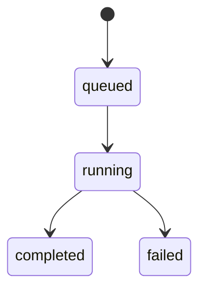

# 设计说明

## 核心决策

1. 平台接入统一放到 JS gateway。
   原因：飞书等 IM 平台的 SDK 现实上更偏 Node.js，后续接新平台成本更低。
2. Rust 只处理可信 turn 请求。
   gateway 已经完成认证和配对，Rust 不再做用户级鉴权。
3. `session_key` 由 gateway 计算。
   这样不同平台可以按自己的线程/群聊模型决定会话边界。
4. `OutboundMessage` 保持最小标准化。
   Rust 不直接输出飞书卡片 JSON，只输出通用文本、post、card、raw 四类消息。

## Session 设计

- 私聊：`feishu:p2p:<open_id>`
- 群聊：`feishu:chat:<chat_id>`
- 话题：`feishu:thread:<chat_id>:<thread_id>`

聊天会话和 agent 运行会话分离：

1. `session_key`
   稳定表示聊天上下文
2. `runtime_instance`
   表示某一个具体的 Claude/Codex 会话和 workspace
3. `conversation_binding`
   表示当前聊天绑定到哪个 active runtime

若是话题消息，gateway 同时传递父会话 `feishu:chat:<chat_id>`。当子会话尚未建立 runtime session 时，Rust 会把父会话最近一次 assistant 输出拼进 prompt。

## Runtime 控制

支持的 control action：

1. `show_runtime`
2. `list_runtimes`
3. `load_runtimes`
4. `create_runtime`
5. `switch_runtime`
6. `set_workspace`

设计规则：

1. 普通消息总是进入当前 active runtime。
2. `/runtime load [workspace]` 只负责把 Claude 本地历史 session 导入当前聊天，不自动切 active runtime。
3. `set_workspace` 若命中已有 `runtime_session_ref`，会新建 runtime instance，而不是原地改旧 session。
4. 控制命令优先于普通 turn，在 gateway 解析后直接走 control API。
5. `/runtime use` 支持完整 `runtime_id`、`runtime_session_ref` 前缀、或 label，避免在 IM 里复制长 id。

Claude 导入规则：

1. 默认读取当前 active runtime 的 workspace。
2. 可显式指定其他 workspace。
3. 优先读取 `sessions-index.json`。
4. 没有索引时回退扫描 `*.jsonl` 前几行元数据。
5. 为兼容 macOS，`/tmp` 和 `/private/tmp` 两种目录键都会尝试。

控制卡片规则：

1. list/show/load 统一使用分行卡片。
2. 每行展示 `Agent / Tag / 会话 / 短ID / Prompt`。
3. `短ID` 优先取 `runtime_session_ref` 前 8 位，否则取 `runtime_id` 前 8 位。

## Turn 生命周期

- `queued`: gateway 已提交，Rust 已建 turn 记录
- `running`: runtime 已启动
- `completed`: 已产出 final message
- `failed`: runtime 启动或执行失败

## 出站槽位

1. `progress`
   用于中间过程、工具执行状态、usage。
2. `todo`
   用于计划或 todo 变更。
3. `final`
   用于本轮最终结果。

gateway 为每个槽位维护自己的 Feishu message id，优先对交互式卡片执行 update，而不是不断追加新消息。

## 飞书消息呈现

当前飞书设计按三张卡片分工：

1. `progress`
   使用灰色共享卡片，持续 update。
   展示重点：
   - `🔄 / ✅ / ⚠️` 运行状态
   - `🛠️` 工具活跃数和最近工具动态
   - `🧵` runtime session 是否已建立
   - `📌` 最近输出摘录
   - `📊` 资源消耗摘要

2. `todo`
   使用橙色共享卡片，只在计划变化时 update。
   状态统一使用图标，不出现 `done/pending` 文字：
   - `✅` 已完成
   - `🔄` 进行中
   - `⏳` 等待中
   - `⛔` 失败或阻塞

3. `final`
   使用绿色结果卡片，不与 `progress` 复用。
   展示重点：
   - `✅` 完成提示
   - `📌` 结论摘要
   - `📝` 最终输出正文
   - `🔖` session 标识

设计约束：

1. 中间态卡片不能退化为原始日志 dump。
2. `progress` 只保留最近输出摘录，不展示整段长文本。
3. `todo` 优先展示进行中和待办项，完成项保留但不抢占视觉焦点。
4. `card` 类型消息不再使用旧式 inline interactive card，而是统一通过 Feishu `CardKit` 发送和更新。

## 认证与配对

认证完全在 gateway：

- `off`
- `pair`
- `allow_from`
- `pair_or_allow_from`

配对存储在 `PAIR_STORE_PATH`，目前只记录允许的 `open_id` 集合。
